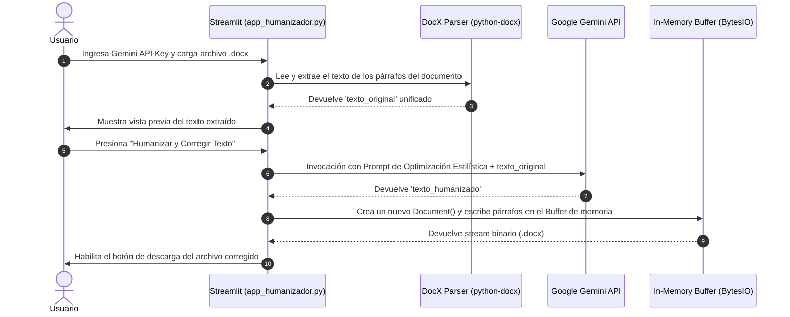

---
# 📄 Manual de Documentación Técnica
**Desarrollado y automatizado bajo la arquitectura de: YisusByte** 🛠️🚀
---

## 1. ¿Qué hace este proyecto?

### Propósito Principal
Este proyecto es una aplicación web de procesamiento de lenguaje natural (NLP) diseñada para la **humanización, corrección y reescritura estilística de documentos Microsoft Word (`.docx`)**. 

El objetivo de negocio e ingenieril es tomar textos que puedan sonar monótonos, rígidos o notoriamente generados por Inteligencia Artificial, y refinarlos mediante un modelo de lenguaje grande (LLM) de la familia **Google Gemini**. El resultado conserva la totalidad del contenido semántico, técnico e histórico original, pero adopta un tono empático, fluido y conversacional, reconstruyendo dinámicamente el documento Word para su inmediata descarga.

### Tecnologías, Frameworks y Dependencias

| Tecnología / Librería | Versión / Ámbito | Descripción y Rol en la Arquitectura |
| :--- | :--- | :--- |
| **Python 3.10+** | Runtime | Lenguaje base de desarrollo. |
| **Streamlit** | Framework Frontend/UI | Proporciona la interfaz gráfica reactiva orientada a datos y la gestión del estado de la aplicación web. |
| **Google Generative AI SDK** | Integración LLM | Cliente oficial (`google.generativeai`) para invocar los modelos de IA conversacional/generativa de Google (Gemini). |
| **python-docx** | Document Processing | Parseo y manipulación estructural de la especificacion OpenXML (`.docx`), tanto para lectura de párrafos como para generación de archivos salida. |
| **io (BytesIO)** | Estándar de Python | Manejo de buffers de memoria binaria para la entrega dinámica de archivos descargables sin necesidad de I/O en disco. |

---

## 2. Estructura del Proyecto y Flujo de Datos

### Diagrama de Distribución de Archivos

```text
.
├── app_humanizador.py  # Aplicación principal de Streamlit (Frontend + Backend Integration)
├── humanizador.py      # Script de automatización/bootstrapping (Generador de código fuente)
└── list_models.py      # CLI Utility Tool para diagnóstico y listado de modelos Gemini
```

### Arquitectura de Interacción y Flujo de Trabajo



---

## 3. Explicación Detallada de Módulos (Paso a Paso)

### 3.1. `app_humanizador.py` (Módulo Principal)
Este módulo representa el núcleo funcional de la aplicación web. Integra la interfaz gráfica, la lógica de integración con la API de IA y el formateo de documentos.

#### Componentes Clave:
1. **Configuración de UI y Sidebar:**
   - `st.set_page_config()`: Establece el título, ícono y layout de la página web.
   - `st.sidebar.text_input()`: Captura de la API Key (campo tipo contraseña) y selección dinámica del modelo LLM (por defecto `models/gemini-3.5-flash`).
2. **Carga y Extracción de Documento (`python-docx`):**
   - El widget `st.file_uploader` recibe el archivo binario `.docx`.
   - Se iteran los párrafos (`doc.paragraphs`) ignorando cadenas vacías para construir un único bloque de texto sin pérdida de contexto (`texto_original`).
3. **Ingeniería de Prompting (Prompt Injection Safe Pattern):**
   - Define un sistema de reglas estrictas enviadas al modelo Gemini:
     - Variación sintáctica y de longitud oracional.
     - Preservación de datos argumentales/técnicos.
     - Supresión de comentarios meta ("Aquí tienes el texto...").
4. **Manejo de Respuestas de la API y Estrategia Fallback:**
   - Para garantizar alta resiliencia frente a cambios en la firma del SDK de Google, implementa la extracción dinámica del atributo `text`. Si no existe, inspecciona la lista de `candidates`.
5. **Generación In-Memory y Descarga:**
   - Parsea el texto devuelto dividiéndolo por saltos de línea dobles (`\n\n`) para mapear cada bloque a un nuevo párrafo en un objeto `Document`.
   - Utiliza `io.BytesIO()` para escribir el binario directamente en la RAM y disponibilizarlo mediante `st.download_button`.

---

### 3.2. `humanizador.py` (Script Metaprogramador / Bootstrapper)
Este archivo funciona como un **script de aprovisionamiento o automatización de código**. 

#### Función Principal:
Contiene dentro de la variable tipo string `code_content` una versión funcional base de la aplicación Streamlit. Al ejecutarse directamente con Python (`python humanizador.py`), sobrescribe o genera el archivo `app_humanizador.py` en el directorio de trabajo local y confirma la creación por la consola estándar.

*Utilidad Arquitectónica:* Permite desplegar de forma automatizada o restaurar la aplicación base a su estado por defecto en entornos de CI/CD o de prueba local.

---

### 3.3. `list_models.py` (Herramienta CLI de Diagnóstico)
Un script de utilidad técnica para el desarrollador/administrador del sistema.

#### Función Principal:
1. Intenta leer la variable de entorno `GENAI_API_KEY`. Si no existe, solicita de forma interactiva la API Key mediante consola (`input()`).
2. Configura la conexión con `google.generativeai.configure()`.
3. Invoca la función `genai.list_models()` e imprime en pantalla el identificador exacto de todos los modelos soportados por la credencial provista.

*Utilidad Arquitectónica:* Ayuda a validar cuotas, permisos y disponibilidad de nuevos modelos (ej. comprobar la existencia de `gemini-1.5-flash`, `gemini-2.5`, etc.) antes de configurarlos en la interfaz gráfica.

---

## 4. Conceptos y Glosario Técnico

* **In-Memory I/O Streaming (`io.BytesIO`)**:
  Estrategia donde los archivos binarios generados se almacenan temporalmente en la memoria RAM como una secuencia de bytes, en lugar de escribirse en el disco duro. Esto optimiza el rendimiento I/O y previene colisiones en entornos multiusuario concurrentes.
* **Prompt Engineering (Zero-Shot Style Transfer)**:
  Diseño estructurado de instrucciones para un modelo de IA sin necesidad de reentrenamiento (*fine-tuning*). Se definen directivas de comportamiento y restricciones críticas para transformar el estilo del texto manteniendo la semántica.
* **OpenXML Parsing (`python-docx`)**:
  Técnica de deconstrucción del formato estándar de Microsoft Word (`.docx`), el cual es internamente un conjunto de archivos XML comprimidos en `.zip`. La librería mapea estos XMLs a objetos orientados a objetos de Python (`Document`, `Paragraph`).
* **SDK Fallback Handling**:
  Patrón de programación defensiva mediante reflexión (`getattr`, `hasattr`) que previene fallos catastróficos en producción si la API de terceros altera la estructura interna del objeto de respuesta (`response.text` vs `response.candidates`).

---

## 5. Guía de Instalación y Ejecución

Sigue estos pasos para desplegar el entorno de desarrollo e iterar sobre el proyecto:

### Paso 1: Clonar / Preparar el Directorio de Trabajo
Asegúrate de tener todos los archivos (`app_humanizador.py`, `humanizador.py`, `list_models.py`) en la misma carpeta raíz.

### Paso 2: Crear y Activar un Entorno Virtual
Es una buena práctica de ingeniería aislar las dependencias:

**En Linux / macOS:**
```bash
python3 -m venv venv
source venv/bin/activate
```

**En Windows (PowerShell):**
```powershell
python -m venv venv
.\venv\Scripts\Activate.ps1
```

### Paso 3: Instalación de Dependencias
Instala los paquetes de Python requeridos utilizando `pip`:

```bash
pip install streamlit google-generativeai python-docx
```

### Paso 4: Validar Modelos Disponibles (Opcional)
Puedes ejecutar el script de utilidad para verificar que tu API Key funciona adecuadamente:

```bash
python list_models.py
```

### Paso 5: Ejecución de la Aplicación Web
Para lanzar la interfaz gráfica de Streamlit, ejecuta en la terminal:

```bash
streamlit run app_humanizador.py
```

Si deseas especificar la dirección del servidor y el puerto local de forma explícita:

```bash
python -m streamlit run app_humanizador.py --server.address localhost --server.port 8501
```

### Paso 6: Uso del Sistema
1. Abre tu navegador e ingresa a la URL provista por Streamlit (habitualmente `http://localhost:8501`).
2. En la barra lateral (**Configuración**), introduce tu **Gemini API Key** obtenida en [Google AI Studio](https://aistudio.google.com/).
3. Arrastra y suelta tu archivo `.docx`.
4. Haz clic en **"✨ Humanizar y Corregir Texto"**.
5. Al finalizar el procesamiento, haz clic en **"📥 Descargar Word Corregido"**.---
# 📄 Manual de Documentación Técnica
**Desarrollado y automatizado bajo la arquitectura de: YisusByte** 🛠️🚀
---

---

## 1. ¿Qué hace este proyecto?

Este proyecto es un **Humanizador y Corregidor de Documentos Word** impulsado por Inteligencia Artificial. Su función principal es procesar documentos de texto en formato `.docx` y reescribir su contenido utilizando los modelos lingüísticos avanzados de **Google Gemini** para que tengan un tono más natural, fluido, conversacional y empático. Al hacerlo, elimina estructuras monótonas o excesivamente formales típicamente asociadas con textos generados por máquinas o redactores robóticos, sin alterar la precisión de la información de fondo (datos históricos, técnicos o argumentales).

### Propósito y Arquitectura Funcional
El sistema actúa en un flujo de tres fases:
1. **Ingesta e Interfaz**: Un usuario carga un archivo `.docx` a través de una interfaz de usuario web interactiva y segura construida en Streamlit.
2. **Procesamiento de Lenguaje Natural**: El texto extraído es enviado mediante una petición estructurada (*prompt engineering*) a la API de **Google Generative AI (Gemini)**.
3. **Reconstrucción e Inyección de Metadata**: La respuesta de la IA se formatea de vuelta a un archivo `.docx` válido en memoria y se le inyectan propiedades específicas del documento (como autoría y comentarios personalizados) antes de ofrecerlo al usuario para su descarga inmediata.

### Tecnologías, Frameworks y Dependencias
El ecosistema del software se basa exclusivamente en tecnologías del entorno **Python**:
*   **Streamlit (`streamlit`)**: Framework utilizado para diseñar y renderizar la interfaz de usuario web de manera ágil sin requerir complejas infraestructuras de Frontend tradicionales (HTML/JS/CSS).
*   **Google Generative AI SDK (`google-generativeai`)**: Biblioteca oficial de Google para interactuar con los modelos generativos avanzados de Gemini (`gemini-1.5-flash`, `gemini-3.5-flash`, etc.).
*   **python-docx (`docx`)**: Librería robusta para leer, manipular y escribir archivos con formato Open XML (`.docx`), esencial para el manejo de archivos Microsoft Word.
*   **BytesIO (`io`)**: Módulo de la biblioteca estándar de Python para gestionar flujos de datos en memoria (Buffers), evitando la escritura temporal innecesaria en el disco del servidor.

---

## 2. Estructura del Proyecto

El sistema está diseñado de manera modular y compacta. A continuación se describe la distribución de sus componentes clave:

```text
📂 root-del-proyecto/
├── 📄 app_humanizador.py   # Aplicación web principal en Streamlit (versión con selector de modelo).
├── 📄 humanizador.py       # Script semilla/generador que escribe en disco la app con metadatos personalizados.
└── 📄 list_models.py       # Script utilitario para auditar los modelos de Gemini disponibles en la API Key.
```

### Flujo de Interacción de Componentes
1. **Generación Inicial (`humanizador.py`)**: Este script puede utilizarse en fases de despliegue para sobrescribir o inicializar la aplicación base `app_humanizador.py` de forma automatizada, configurando propiedades internas del archivo final tales como el autor del metadato (`YisusByte`).
2. **Ciclo de Ejecución Principal (`app_humanizador.py`)**:
   * El cliente accede vía navegador.
   * El cliente provee su clave de API de Gemini y un documento `.docx`.
   * El parser interno descompone el documento párrafo por párrafo.
   * Se evalúa el texto, se construye el prompt optimizado y se envía al modelo LLM.
   * Se procesa la respuesta de manera defensiva (mitigando nulos o estructuras vacías).
   * Se empaqueta en un nuevo binario descargable.
3. **Diagnóstico (`list_models.py`)**: Un servicio auxiliar ejecutado en terminal que permite al administrador de sistemas o desarrollador validar qué modelos de LLM están activos bajo la API Key del cliente, evitando errores de ejecución por llamadas a modelos deprecados o inexistentes.

---

## 3. Explicación de Módulos (Paso a Paso)

### 📄 Módulo 1: `app_humanizador.py`
Este es el motor de la interfaz web y orquestador del servicio.

*   **Configuración e inicialización (`st.set_page_config`, `st.title`)**: Configura el contenedor web del navegador con el título, layouts centrados y un icono representativo de edición de textos.
*   **Barra Lateral de Configuración**:
    *   Entrada protegida para la `api_key` de Gemini (enmascarada con `type="password"`).
    *   Entrada interactiva para especificar el modelo a usar (`models/gemini-3.5-flash` por defecto).
*   **Lectura de Archivos**:
    ```python
    doc = Document(uploaded_file)
    texto_completo = []
    for parrafo in doc.paragraphs:
        if parrafo.text.strip():
            texto_completo.append(parrafo.text)
    ```
    Este fragmento ignora líneas vacías y extrae únicamente texto útil del archivo subido para optimizar los tokens enviados a la API.
*   **Llamada Segura a la API (Lógica Defensiva)**:
    Instancia el modelo y define un fallback para extraer el texto generado por Gemini:
    ```python
    texto_humanizado = getattr(respuesta, 'text', None)
    if texto_humanizado is None:
        if hasattr(respuesta, 'candidates') and respuesta.candidates:
            texto_humanizado = getattr(respuesta.candidates[0], 'text', str(respuesta.candidates[0]))
    ```
    *Garantiza que, si la estructura interna del JSON de respuesta cambia de versión, la aplicación capture el texto de forma segura sin romperse.*
*   **Reconstrucción y Descarga**: Reconstruye la estructura del Word agregando párrafos basados en separadores de salto de línea doble (`\n\n`), los almacena temporalmente en un buffer de tipo `io.BytesIO` y dispara un disparador de descarga (`st.download_button`).

### 📄 Módulo 2: `humanizador.py`
Actúa como un **Generador de Código** o archivo semilla de auto-despliegue.

*   **Propósito**: Almacena en la variable `code_content` una versión preconfigurada de la aplicación interactiva que incluye personalizaciones específicas y metadatos de autoría para los archivos Word generados:
    ```python
    core_properties = doc_salida.core_properties
    core_properties.author = "YisusByte 🛠️🚀"
    core_properties.comments = "Documento corregido y humanizado..."
    ```
*   **Operación I/O**: Abre un puntero de archivo y escribe el contenido encapsulado con codificación `utf-8` para prevenir problemas de decodificación de emojis y caracteres especiales en sistemas Linux y Windows.

### 📄 Módulo 3: `list_models.py`
Script de backend utilitario.

*   **Propósito**: Ayuda a diagnosticar incompatibilidades de API.
*   **Mecanismo**: Recupera la credencial de forma segura desde las variables de entorno (`os.environ.get("GENAI_API_KEY")`) o por consola en su defecto. Llama a la función del SDK `genai.list_models()` e imprime en consola la nomenclatura exacta de cada modelo habilitado. Esto evita que el usuario ingrese strings incorrectos de modelos en la aplicación principal.

---

## 4. Conceptos y Glosario Técnico

*   **Prompt Engineering (Ingeniería de Prompts)**: Es el diseño sistemático de las instrucciones proporcionadas a un modelo de IA. En este proyecto se utiliza una técnica de *instrucciones de rol y restricciones críticas* (reglas del 1 al 4) para asegurar que el modelo no asuma libertades creativas que cambien la veracidad técnica de los textos.
*   **Buffer de Bytes (`io.BytesIO`)**: Es un flujo en memoria que simula ser un archivo binario en disco físico. Al usarlo, el servidor web no necesita escribir archivos físicos en el sistema local, optimizando significativamente la velocidad del servicio, disminuyendo el uso de almacenamiento y previniendo colisiones de archivos concurrentes entre distintos usuarios.
*   **Metadatos de Documento (Core Properties)**: Propiedades embebidas en el contenedor ZIP que conforma un archivo `.docx`. El script `humanizador.py` edita estas propiedades (Autor y Comentario) directamente dentro de las cabeceras XML del archivo para garantizar la trazabilidad de la autoría de **YisusByte**.
*   **Modelos Generativos Flash (`gemini-1.5-flash`/`gemini-3.5-flash`)**: Modelos optimizados de Google diseñados para tareas de análisis rápido y síntesis de texto a baja latencia y alta eficiencia en costo.

---

## 5. Guía de Instalación y Ejecución

Sigue estos pasos lógicos para configurar el entorno y poner en marcha el proyecto en cualquier sistema operativo local o servidor en la nube.

### Paso 1: Clonar o Descargar el Proyecto
Asegúrate de tener los archivos fuente en un mismo directorio local:
```bash
📂 humanizador-word/
├── app_humanizador.py
├── humanizador.py
└── list_models.py
```

### Paso 2: Crear un Entorno Virtual de Python
Es una buena práctica para aislar las dependencias de este software y evitar conflictos con otras librerías del sistema.

*En macOS/Linux:*
```bash
python3 -m venv venv
source venv/bin/activate
```

*En Windows (PowerShell):*
```powershell
python -m venv venv
.\venv\Scripts\Activate.ps1
```

### Paso 3: Instalar las Dependencias requeridas
Ejecuta el gestor de paquetes `pip` para instalar los requerimientos del proyecto:
```bash
pip install streamlit google-generativeai python-docx
```

### Paso 4: (Opcional) Auditar modelos disponibles de Gemini
Para verificar que tu API Key funciona correctamente y visualizar los modelos a los que tienes acceso, puedes ejecutar el script utilitario:
```bash
python list_models.py
```
Introduce tu API Key cuando se te solicite en la terminal. Deberías ver un listado de modelos disponibles como resultado.

### Paso 5: Ejecutar la Aplicación Web
Para lanzar el servidor interactivo de Streamlit, ejecuta el siguiente comando en la consola:
```bash
streamlit run app_humanizador.py
```

### Paso 6: Usar la Aplicación
1. Una vez ejecutado el comando del **Paso 5**, se abrirá automáticamente una ventana en tu navegador por defecto apuntando a la dirección `http://localhost:8501`.
2. Introduce tu **Gemini API Key** en la barra de configuración lateral.
3. Elige el modelo por defecto o cámbialo en el campo de texto (ej. `models/gemini-1.5-flash`).
4. Sube tu archivo `.docx` a la zona de carga central.
5. Presiona **✨ Humanizar y Corregir Texto**.
6. Una vez que termine el procesamiento con IA, previsualiza el resultado y haz clic en **Descargar Word Corregido**.
